# Deploying a Virtual Machine (EC2 Instance) on AWS and Installing Nginx

In this guide, we will walk through the process of deploying a virtual machine (EC2 instance) on AWS using the GUI console and installing the Nginx web server on it. We'll cover various steps involved in launching an EC2 instance, configuring security groups, connecting to the instance via SSH, and installing Nginx.

## Step 1: Locate EC2

Navigate to the AWS Management Console and search for "EC2" in the services search bar. Click on the "EC2" service to access the EC2 dashboard.

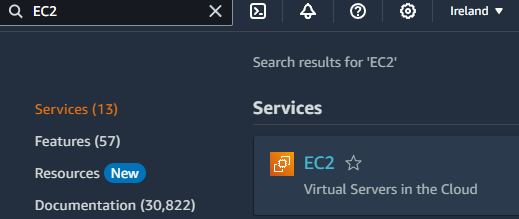

## Step 2: Launch Instance

From the EC2 dashboard, click on the "Launch Instance" button to start the instance creation process.

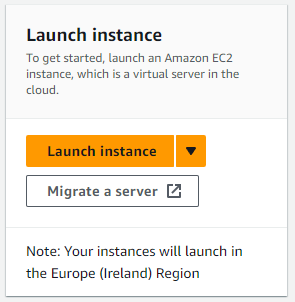

## Step 3: Name Instance

Choose an Amazon Machine Image (AMI) for your instance. You can select from various Linux distributions, including Ubuntu, CentOS, etc. Configure the instance details such as instance type, network settings, and storage.

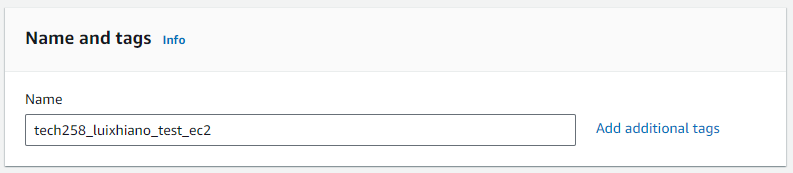

## Step 4: Application and OS Images

Select the desired instance type based on your requirements. 

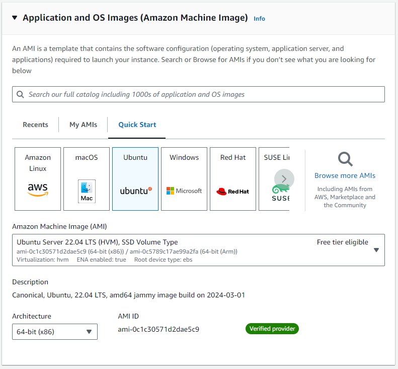

#### Explanation:
- **Machine Images**: Choose an Amazon Machine Image (AMI) for your instance. AMIs contain the operating system and software necessary for your virtual server. Common choices include Ubuntu, CentOS, etc.

## Step 5: Instance Type

Choose the "t2.micro" instance type for a basic setup.

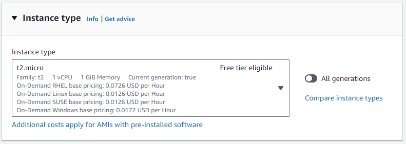

## Step 5: Key Pair (Login)

Create or choose an existing key pair to connect to your instance securely. Download the private key (.pem file) and save it in a secure location.

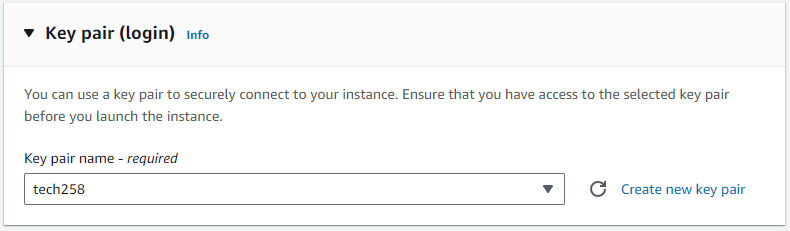

#### Explanation:
- **SSH keys and how we are using them in this case**: SSH keys provide secure access to your instance. We create or select an existing SSH key pair, download the private key (.pem file), and use it to authenticate with the instance via SSH.

## Step 6: Network Settings

Configure the network settings for your instance, including the VPC, subnet, and security group. Ensure that the security group allows inbound traffic on ports 22 (SSH) and 80 (HTTP) to access the instance.

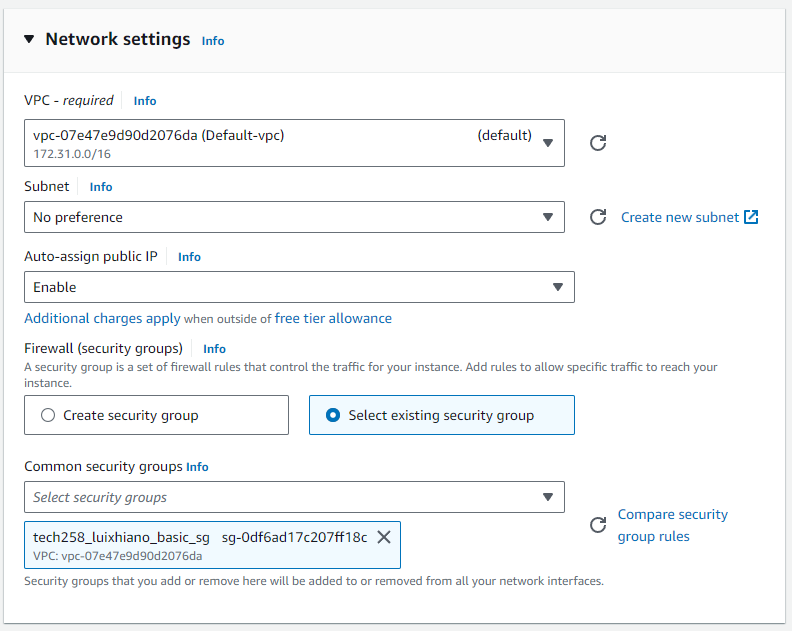
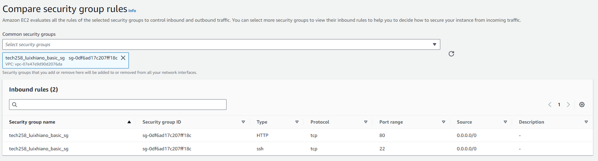

#### Explanation:
- **Security Groups (and what are ports?)**: Security groups act as virtual firewalls, controlling inbound and outbound traffic to your instance. Ports are communication endpoints used by applications. Here, we configure the security group to allow SSH (port 22) for remote access and HTTP (port 80) for web traffic to access Nginx.

## Step 7: Configure Storage

Specify the storage options for your instance. You can choose the default settings or customize the storage volumes as needed.

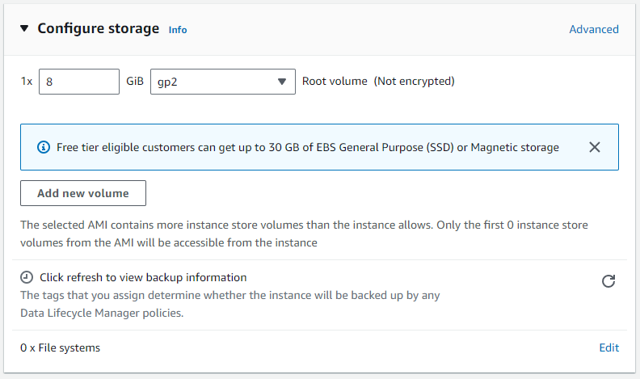

## Step 8: Advanced Details

Review the advanced instance settings and make any necessary changes. You can add user data scripts or configure other advanced options if required.

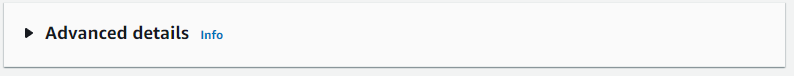

## Step 9: Summary

Review the instance details and configurations. Click on the "Launch" button to launch the instance.

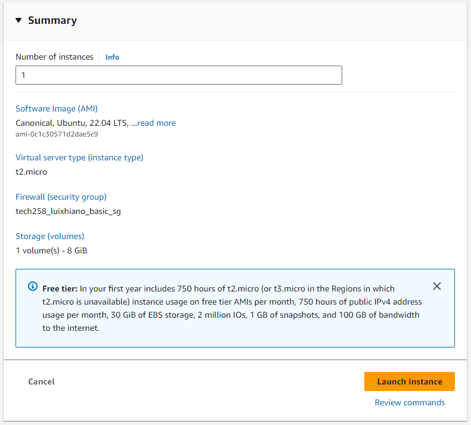

## Step 10: Click on the Instance ID

Once the instance is launched, navigate to the EC2 dashboard and click on the instance ID to view its details.

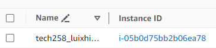

## Step 11: Click on "Connect"

From the instance details page, click on the "Connect" button to get instructions on how to connect to the instance via SSH.

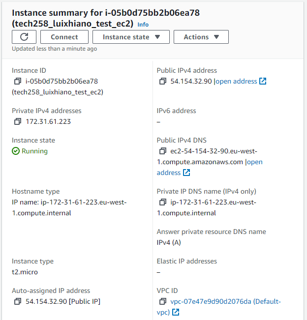

## Step 12: Copy the Instance IP

Copy the public IP address of the instance, which will be used to connect to the instance via SSH.

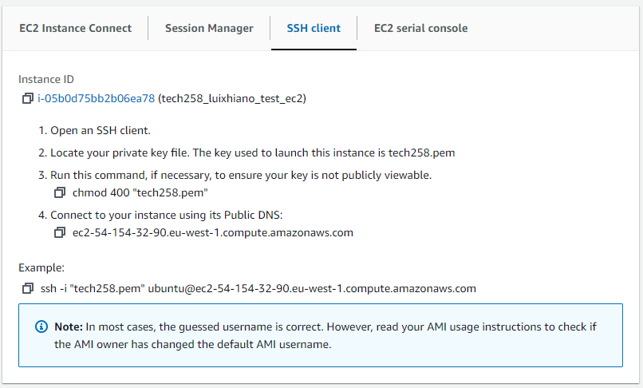

## Step 13: Open an SSH Terminal

Open an SSH terminal on your local machine and navigate to the directory where the .pem file is located.

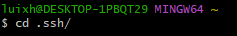

## Step 14: Modify the .pem File

Change the permissions of the .pem file to ensure it is not publicly accessible using the command `chmod 400 your-key.pem`.

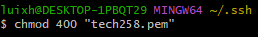

## Step 15: Connect to the Instance

Connect to the instance using the SSH command with the .pem file and the instance's public IP address.

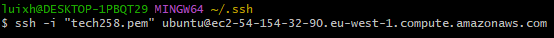
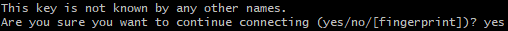

## Step 16: Sudo Update

Run `sudo apt update -y` to update the package lists for upgrades and new package installations.

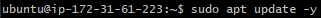

#### Explanation:
- **Any commands we need to run, for example**: We run `sudo apt update -y` to update package lists, ensuring our system has the latest software versions and security patches. Adding `-y` flag automatically answers "yes" to any prompts, making the process non-interactive.

## Step 17: Sudo Upgrade

Run `sudo apt upgrade -y` to upgrade all installed packages to their latest versions.

#### Explanation:
- **Any commands we need to run, for example**: We run `sudo apt upgrade -y` to upgrade installed packages to their latest versions, ensuring system security and stability.

## Step 18: Install Nginx

Install the Nginx web server using the command `sudo apt install nginx`.

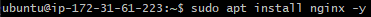

#### Explanation:
- **What is nginx?**: Nginx is a high-performance web server and reverse proxy server. We install it here to host web applications on our EC2 instance.

## Step 19: Check Nginx Status

After installation, check the status of the Nginx service to ensure it is running using the command `sudo systemctl status nginx`.

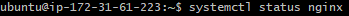
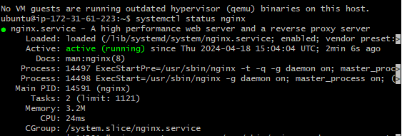

#### Explanation:
- **How do we check the software we installed is running?**: We use `sudo systemctl status nginx` to check the status of the Nginx service. If Nginx is running properly, the output will indicate that the service is active and running.

## Step 20: Check the Website

Finally, open a web browser and enter the public IP address of your instance. You should see the default Nginx welcome page, indicating that Nginx is successfully installed and running.

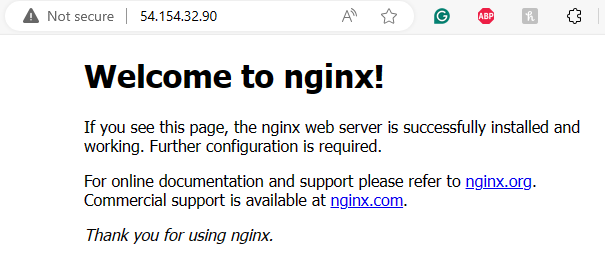

#### Explanation:
- **Showcasing how to access the webserver we installed**: To access the Nginx web server, open a web browser and enter the public IP address of your EC2 instance. You'll see the default Nginx welcome page, confirming successful installation and operation.

You have successfully deployed a virtual machine on AWS and installed Nginx on it. You can now host websites or web applications on your EC2 instance.
